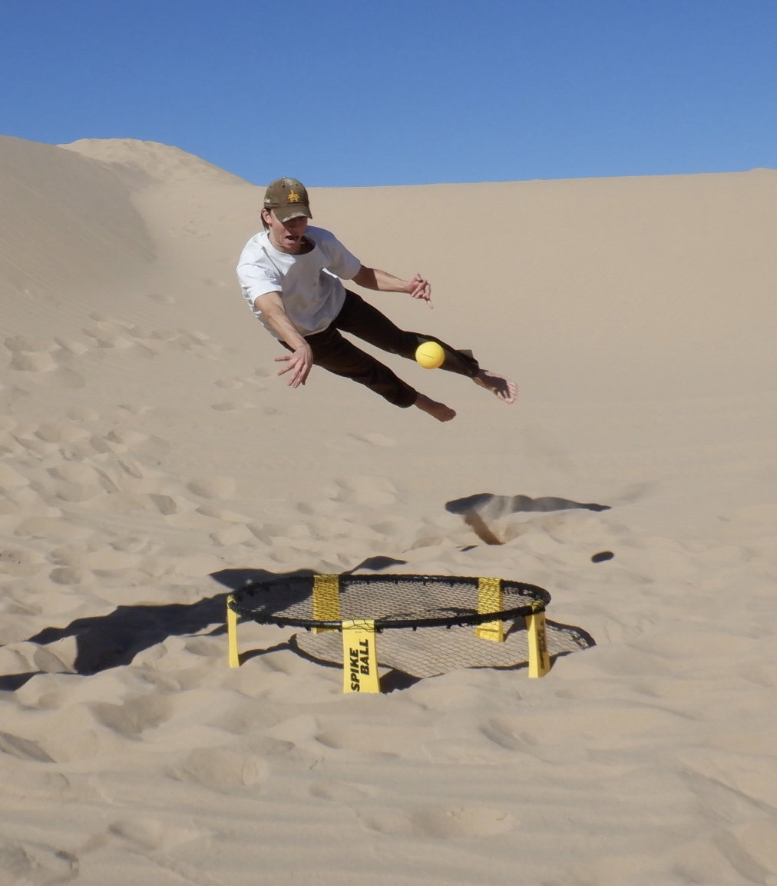

# Jared Jose's Web Portfolio
[Programming](#programming)
[Extracurriculars](#extracurriculars)

## Programming
### For School
As a ***Computer Science*** major at UCSD I have completed many coding projects in the pursuit of my undergraduate degree. Through the **ERSP program**, I have the privilege of working on an NLP/Social Computing project under the guidance of *Professor Imani Munyaka*. I hope to pursue a career in Software Engineering with a focus on creating ~~more wealth~~ a more sustainable and eco-conscious world. 

I believe my stregnths are as follows:
1. Ability to explain code in laymans terms
2. Hard-working
3. Calm under pressure

My Goals for this quarter in terms of becoming a better programmer:
- [ ] Continue daily LeetCode problem streak.
- [ ] Maintain a balance between screen-time and free-time
- [x] Become proficient in R and Python

### For Fun
In the pursuit of learning to leverage progrmaming to solve real problems, I have completed a variety of small projects to further expand my skill set. Some highlights are as follows:
- A ML project which leveraged NEAT to facilitate the completion of the first level of Super Mario World.
- A python script which determined who was not following me back on the social media platform Instagram.
- Hello World!

```
print("Hello World!")
```

## Extracurriculars
I play for the UCSD Men's Ultimate Frisbee Team (Bloop Bloop Air Squids!) and love the outdoors. Some of my favorite things are surfing, skating, spike-ball, climbing, and hiking! I also have a passion for giving back to the community which has helped shape the person I am today. An example of this is acting as a Project Mentor for the SPIS program @ UCSD ([Link](http://spis.ucsd.edu/people.html))!

> Bloop Bloop Air Squids!
> 
